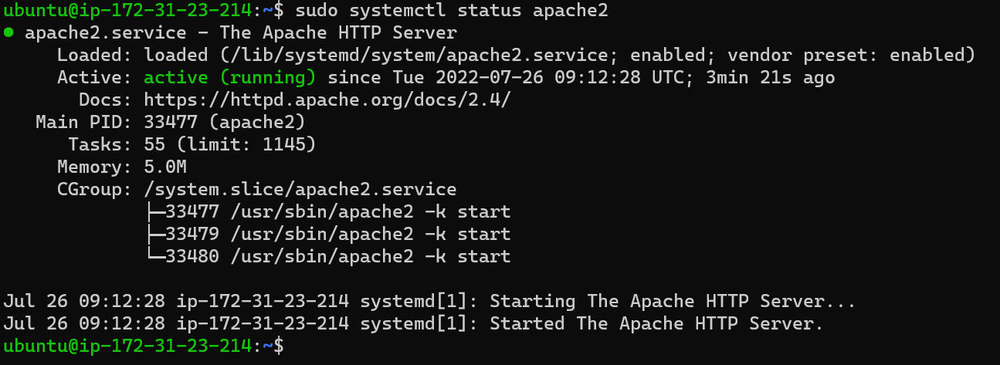
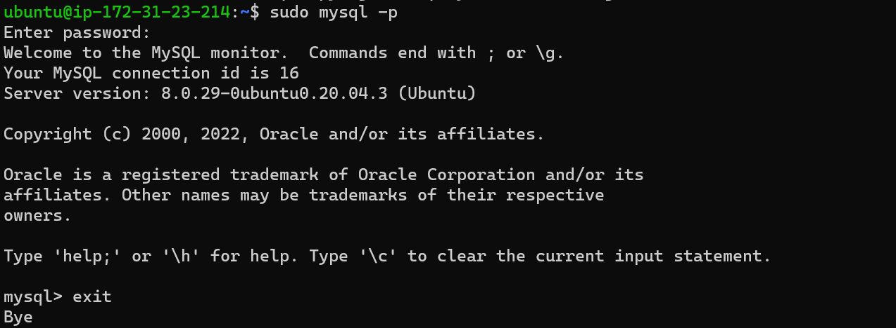

## Project 1 Documentation Expressed

 	Project 1 is also project LAMP(Linux, Apache, MySql, PHP).
    successful update of list of packages in package manager in terminal with the following cmd; 
`sudo apt update`

    successful installation of apache2 package in terminal with the following cmd; 
`sudo apt install apache2`
    
    successful confirmation that apache2 is running in terminal with the following cmd; 
`sudo systemctl status apache2`

successful installation of mysql in terminal with the following cmd; 
`sudo apt install mysql-server`

successful login to mysql console with the following cmd;
`sudo mysql`

successful installation of PHP(php package,php-mysql,libapache2-mod-php) in terminal with the following cmd;
`sudo apt install php libapache2-mod-php php-mysql`

successful confirmation of PHP version in terminal with the following cmd; 
`php -v`

